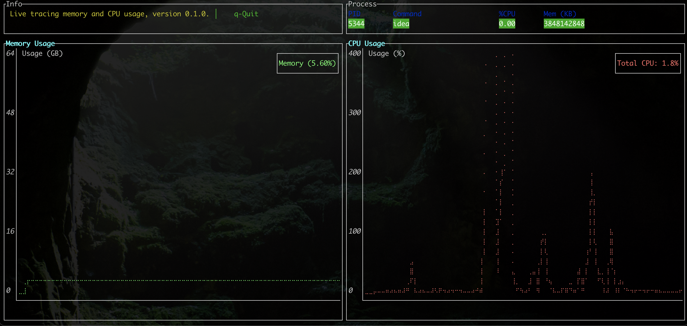

# TRACER

Monitor live application either as child process or separate PID, collecting /displaying stats ( cpu usage, memory usage).

_Note: For monitoring one-shot applications - see [https://github.com/yarenty/app_benchmark](https://github.com/yarenty/app_benchmark)._

## CLI

### Build

```shell
cargo build -r --bin tracer 
```
### Usage

```shell
app-tracer 0.1.0
Tracing / benchmarking long running applications (ie: streaming).

USAGE:
    tracer [OPTIONS] [APPLICATION]

ARGS:
    <APPLICATION>    Application to be run as child process (alternatively provide PID of
                     running app)

OPTIONS:
    -h, --help                 Print help information
    -l, --log <LOG>            Set custom log level: info, debug, trace [default: info]
    -o, --output <OUTPUT>      Name of output CSV file with all readings - for future investigations
                               [default: output.csv]
    -p, --pid <PID>            PID of external process
    -r, --refresh <REFRESH>    Refresh rate in miliseconds [default: 1000]
    -V, --version              Print version information

```

### Example output

```log
12:20:23.407 (t: main) INFO - tracer - Application by PID to be benchmark is: 5344
12:20:23.408 (t: main) INFO - tracer - Refresh rate: 1000
12:20:23.408 (t: main) INFO - tracer - Starting with PID::5344
12:20:24.493 (t: main) INFO - tracer - CPU: 0, MEM: 3780952064
12:20:25.498 (t: main) INFO - tracer - CPU: 6.6926346, MEM: 3780952064
12:20:26.500 (t: main) INFO - tracer - CPU: 7.279213, MEM: 3780952064
12:20:27.505 (t: main) INFO - tracer - CPU: 6.3983507, MEM: 3780952064
12:20:28.510 (t: main) INFO - tracer - CPU: 7.1348634, MEM: 3780952064
12:20:29.514 (t: main) INFO - tracer - CPU: 7.176454, MEM: 3780952064
```

## TUI

### Build

```shell
cargo build -r --bin uitracer 
```

### Usage

```shell
 cargo run --bin uitracer -- /opt/workspace/app_banchmark/target/debug/examples/test_app   
 
```

### Example output

```log

```



Also in current directory output csv file is generated for future processing / investigation.

Example output.csv file:

```csv
Time,Cpu,Mem
16:57:24.826086,4268572672,0
16:57:25.828262,4268498944,11.10776
16:57:26.829334,4268498944,6.1443987

```

